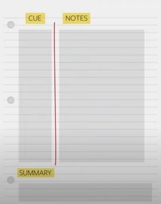

# Cornell Notes

## Summary
* Cornell Notes are a method of note-taking.
* Improves info retention and understanding by...
    * Prompting your brain to consider new material in several different ways:
        * Writing down facts (Notes)
        * Writing down questions (Cue)
        * Summarizing what you learned (Summary)

## Tips
* Modify this method to your needs
    * Change cues to Comments
    * Do one full page Notes, with a full Cue section on the back
    * Use abbreviations and symbols
* Don't skip the summary portion
* Capture the gist and important details

## Sources
"How to Use Cornell Notes" *Youtube* @learningstrategiescenterco2164
[https://youtu.be/nX-xshA_0m8?si=6oDDe_7L-l25rNNN](https://youtu.be/nX-xshA_0m8?si=6oDDe_7L-l25rNNN
)
