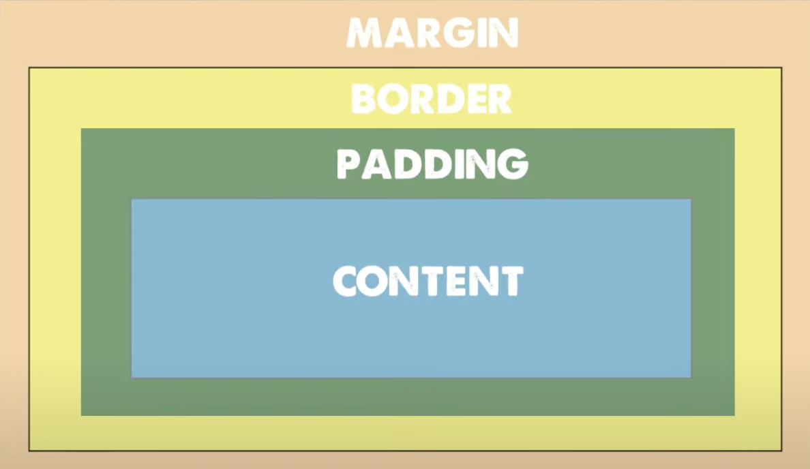

# CSS Basics
It's best to create and import a stylesheet.css file, rather than write css directly into an hml document.

## Selectors
Selectors search HTML for elements, classes, IDs or chains the stylesheet.
Keep your selectors as simple as possible - a single name is best case scenario.

### Element

Index.html

    <h1>Hello</h1>

Stylesheet.css

    h1 {
        /* styles here */
    }

### Class
Index.html

    <h2 class="secondary">Welcome to my site</h2>

Stylesheet.css

    .secondary {
        /* styles here */
    }

#### Pseudo-classes
Stylesheet.css

    button {
        /* styles here */
    }

    button:hover{ 
    /* styles here */
    }

### ID

Index.html

    
Here's a paragraph

Stylesheet.css

    #main-text {
        /* styles here */
    }

### Chains
Chains multiple elements together.

#### **Comma**

    h1, h2
    
    Means ALL H1 AND H2

#### **Space**

    h1 h2
    
    Means ALL H2 INSIDE H1

#### **Greater Than**
        
    .hero > h2

    Means ALL H2 1 LEVEL DEEP IN .HERO

## Attributes
The actual styles we apply after selecting. Applied Top to Bottom. More specific selectors get priority, so it goes from: ID > Class > Elements. This is called specificity.

### Color Attributes

    .hero {
        color: white;
        background-color: skyblue;
    }

### Font Family

    h1 {
        font-family: 'Franklin Gothic Medium', 'Arial Narrow', Arial, sans-serif';
        font-size: 4rem;
    }

    You'll always see more than one font family in case the first one doesn't work.

### Background Properties

    div {
        background-color: skyblue;
        background-image: url('img.png');
        background-repeat: no-repeat;
        background-size: fixed;
        background-position: center;
    }

    You can use the shorthand background syntax to put these all in one line.

    div {
        background: skyblue url('img.png') no-repeat fixed center;
    }

### Shadows

        div {
            box-shadow: 10px 10px 5px 0px rgba(0,0,0,0.75);
        }

        You can use a box shadow generator to make this. 
        Weblot, Moz, O, MS are vendor prefixes - these are used for backward compatibility. 

### Media Queries
Allow us to style for mobile and different screen sizes. Triggered by breakpoints (if width is greater than x then a style gets applied).

### Layout Attributes

#### Box Model

    .hero {
        background-color: cornflowerblue;

        width: 100px;
        height: 20px;
        padding: 10px
        border: 1px solid black;
        margin: 10px;
    }

##### Content
Width and height are best set as percentages of the parent container.

##### Padding

    You can have 1, 2 or 4 values.

    .hero {
            padding: 10px; <-- All 4 sides
            padding: 10px 20px; <-- Top & Bottom, Left & Right
            padding: 10px 20px 30px 40px <-- Top Right Bottom Left (goes clockwise from top)
    }

    You can also set them individually like so:

    .hero {
        margin-top: 10px;
        padding-left 20px;
    }

Padding and Content will take on the element's background-color, Margin and Border will not.

You can use pixel values or REM (A relative measurement to the base font size, useful for responsive designs - if you change the main font size it'll change everything).

##### Border
Between padding and margin. Has three part syntax: size, type, color.

     .hero {
        border: 1px solid black
     }

##### Margin
    Works exactly the same as padding with 1, 2 or 4 values. But background will not extend into the margin.

#### Display Property

##### Inline: For continuous line.

##### Block: To space things out

##### Inline-Block: Gives benefits of both Inline and Block. Able to set the top and bottom padding but still have the same line.

## Coming Soon:

How rem and font families works.

#### CSS Grid
You can specify an exact grid, great for building based on a design or UX wireframe.

#### Display Flex
For general and spacing as you go. 

