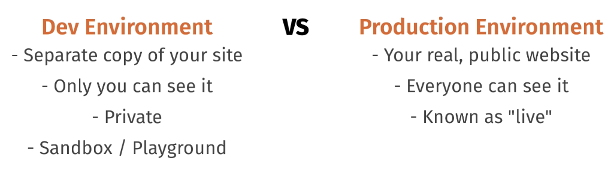

# Setting up a local dev environment

## Installing Wordpress

Wordpress needs an environment with the following three things:
* PHP
* Apache (NGINX)
* MySQL (MariaDB)

1. Download and install Local by Flywheel https://localwp.com/
2. Open and click Create a new site
    * Enter site name
    * Select Preferred
    * Enter usename, password and email.
    * Click Add Site

Once it's done, you'll have your own local dev environment copy of wordress running on your computer.

## Where your Wordpress files live

Files on your local drive with be found under your home directory, in the Local Sites folder.

Click the folder for your site name, then app, then public - these files will be the ones you're mainly working with.

## Download VS Code

This is your text editor, which also contains a command line withing the program. https://code.visualstudio.com/