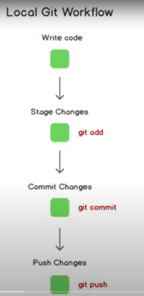

# Git Basics

## Git Workflow

### Create
Create a new file or change an existing file.

### Stage Files
Tracks a file to be saved in Git.

    git add . will track all untracked files
    git add <filename or folder> will track specific file and folders 

### Commit
Saves the changes locally in git.

    git commit -m "What and why you're committing" -m "some description"

### Push
Committed changes are pushed to the remote directory.  
origin = location of our git repository  
main - branch we want to commit to.

    git push origin main

## Terminal Commands

### Change directory  

    cd <directory-name>

### List 
List all files in directory

    ls 

### Status
Show what files are modified and tracked

    git status

### Add Origin
Add a reference to the remote repository on github

    git remote add origin <ssh-code>

### List Repositories
Shows any remote repositories you've connected to this repo

    git remote -v

### Set Upstream
Say where you want to push to by default

    git push -u <origin master or other location>

### Unstage Files
Unstage files set to be committed.

    git restore --staged <file>...

### Check how many branches
Star beside = branch you're currently on
   
    git branch

### Switch between branches

    git checkout

### Make new branch

    git checkout -b <feature-name>

