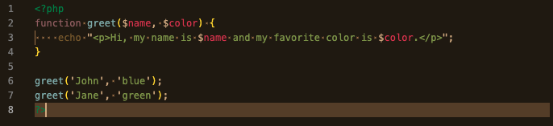
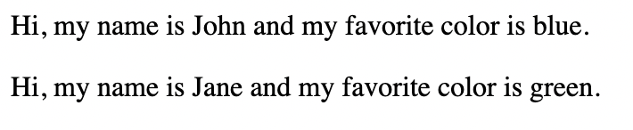

# PHP Basics

It's a server side language: all of our php code runs on a server and only the result (not the code) gets sent to the visitor's browser

## Table of Contents

* [Begin and End PHP](#id-begin)
* [Echo](#id-echo)
* [Semi-colon](#id-semi)
* [Variable](#id-variable)
* [Function](#id-function)
* [Array](#id-array)

## Begin and End PHP
Begin and end php mode with this: 
    
    <?php ?>

You can seamlessly jump in and out between php and html.

## Echo
echo is how you output something to the page while in php mode

    echo 2+2 

## Semi-colon
A semi-colon tells php that we're done with the current task and ready to move on to a new task.

    <?php 

        echo 2+2; 

    ?>

## Variable 

### Creating a variable
A $ is how you create a variable. 

    <?php 

        echo 2+2; 
        $myname='Brad';

     ?>

### Referencing a variable:

Reference a variable like this:

    <?php 

        echo $myname 

    ?>

## Function 

### Defining a Function

To define a function, write function + a name for the function.

    <?php

        function myFirstFunction() {
            echo "
Hello, this is my first function.
";
        }
    ?>

### Calling a Function
Call a function like this (must be writing in php mode):

    myFirstFunction();

All together it'll look like this:

    <?php

        function myFirstFunction() {
            echo "
Hello, this is my first function.
";
        }

        myFirstFunction();
    ?>

You can call a function multiple times, and you only have to define it once.

### Setting Parameters
Parameters are like hollowed-out variables that can be used within a function. They are containers that can receive the incoming 'arguments' (explained below) The parameters in this example are $name and $color. 

    <?php

        function greet($name, $color) {
            echo "
Hi, my name is $name and my favorite color is $color.
";
        }

        greet();
        greet();

    ?>

### Arguments 
Arguments are specified when we call a function. They are added after the function name, inside the parentheses like below. If you have two arguments, you'll need to have two parameters to receive them.

    greet('John', 'blue');
    greet('Jane', 'green');

Here it is all put together, and how the function displays in the browser.

An argument is just like a variable. Arguments are specified after the function name, inside the parentheses. You can add as many arguments as you want, just separate them with a comma. 

## Arrays 
Think of an array as a collection. You can define an array like this:

    <?php 

        $names = array('Brad', 'John', 'Jane', 'Meowsalot');

    ?>

The different names within our array can be called by number, starting with 0. So, 0 would call Brad, 1 would call John, 3 would call Meowsalot etc.

    <?php 

        $names = array('Brad', 'John', 'Jane', 'Meowsalot');

    ?>

    
Hi, my name is <?php echo $names[1]; ?>.

### Looping
One of the reasons we use arrays is for looping. like if we want to do something once for each item in a collection (maybe the 'Hi my name is' sentence for each name in the array). We can programmically loop through the collection, rather than just manually writing the same sentence with four times, each with a different name.

#### While Loop
In a while loop, whatever lives in the curly brackets {} will happen again and again until whatever lives in the parenthesis () evaluates to false.

##### Example: creating a bulleted list that counts to 100.

In the below example, we've ...
* created the $count variable, set to equal 1. 
* parenthesis () is saying 'as long as the count is less than 101, keep doing what's in the curly brackets {}'
* the curly brackets are echoing out an html list item.
    * first we echo out a 1 by echoing the $count variable
    * the next line increases the count variable with "++" which add a 1 to it. The second time the while loop.
    * the third time the loop runs, it will echo out the new count (which is now 2) plus 1 more (so ultimately it echos out '3').
    * one the loop is 101 or greater, it will stop the loop.

Example

    <?php 

        $names = array('Brad', 'John', 'Jane', 'Meowsalot');

        $count = 1
        
        while($count < 101) {
            echo "<li>$count</li>";
            $count++;
        }
    ?>

If you were echoing the array of $names you could put while($count < count($names) which will tell it to count the number of items in that array and always refer to that number.

