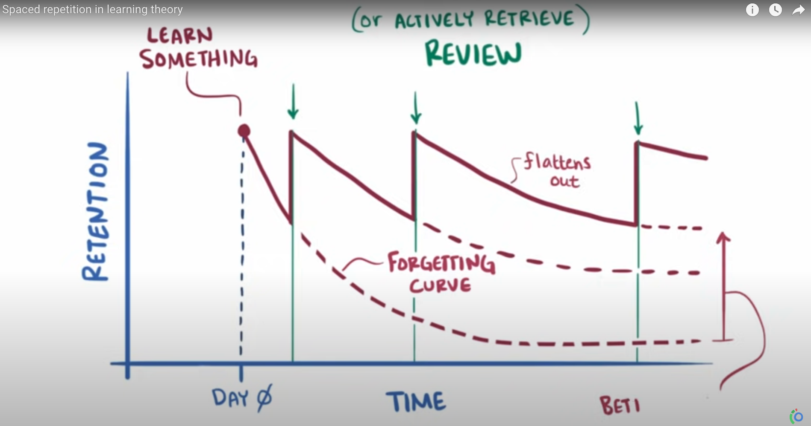

# Spaced Repetition

## Summary
Based on a study of application of attention vs time. When you learn something on Day 0 and then never review it, there is a Forgetting Curve where retention gradually decays over time.
Alternatively, if you review that material at increasingly spaced intervals after learning it, the forgetting curve flattens out. Best time to review is right as you're forgetting the info. 

Devs are making software that helps using space repetition: questions are posed and the ones you got wrong are prioritized for repetition using an algorithm. 

## Sources

"Spaced repetition in learning theory" *Youtube* @osmosis  
[https://www.youtube.com/watch?v=cVf38y07cfk](https://www.youtube.com/watch?v=cVf38y07cfk)
